# Build_Environment_OpenCV_CXX
This repo provides tutorials on building environment of OpenCV (C++) on Windows and Mac (Both Intel and Apple silicon)

## Windows
**Reference**

1. [【C/C++】VS Code配置Opencv用于机器视觉数字图像处理技术](https://blog.csdn.net/qq_37365857/article/details/103490774?utm_medium=distribute.pc_relevant.none-task-blog-2~default~baidujs_baidulandingword~default-4-103490774-blog-124402319.pc_relevant_3mothn_strategy_and_data_recovery&spm=1001.2101.3001.4242.3&utm_relevant_index=7)

2. [Using GCC with MinGW](https://code.visualstudio.com/docs/cpp/config-mingw)

3. [MinGW C++ Download and Installation](https://www.ics.uci.edu/~pattis/common/handouts/mingweclipse/mingw.html)

### **System Configurations**

**OS**: Windows11 22H2

**Text Editor**: Visual Studio Code 1.75.0

**Build Tool**: Cmake 3.26.0-rc 1

**Compiler**: gcc/g++ (8.1.0) by MinGW 

### **I. Preparation**
We need to make sure the following parts are installed: 1. Visual Studio Code (aka VS code) 2. MinGW 3. OpenCV 4. CMake

**I.1 Install VS code**

VS code is a handy and versitile text editor. It can be downloaded from the official website at [https://code.visualstudio.com/download](https://code.visualstudio.com/download)
Open VS code, go to "Extensions" and search "c/c++". Install the C/C++ extension provided by Microsoft. After the installation, researt VS code.

<p align="center">
  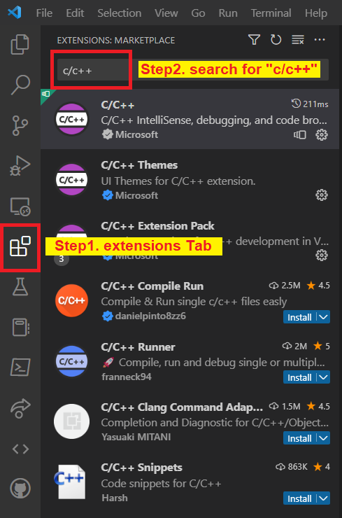
</p>

**I.2 Install OpenCV**

OpenCV can be downloaded at [https://opencv.org/releases](https://opencv.org/releases/). Follow the onscreen instructions and finalizae the installation. **Make sure you note the installation path.** In my case, it is installed at `D:\opencv`. This location is denoted as `$CV$` in the rest of this tutorial for Windows.

<p align="center">
  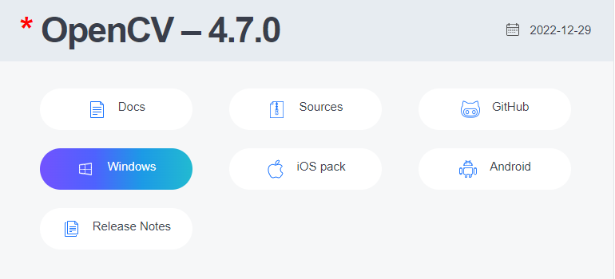
</p>

Then you want to create a new folder under `$CV$/build/x64` called `MinGW` (it is empty as of now).

<p align="center">
  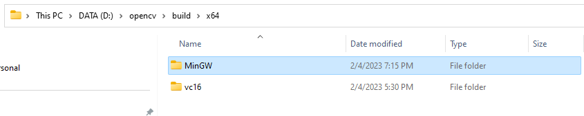
</p>

**I.3 Install CMake**

CMake can be downloaded at [https://cmake.org/download](https://cmake.org/download/). Follow the onscreen instructions and finalizae the installation. **Make sure you note the installation path.** In my case, it is installed at `D:\CMake`, denoted as `$CMAKE$`.

<p align="center">
  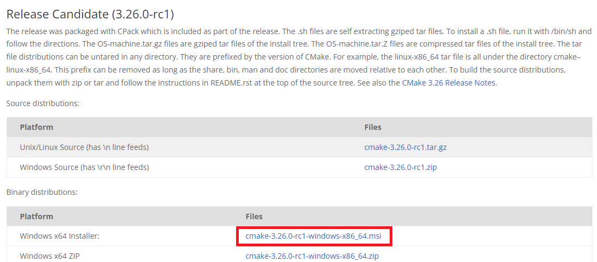
</p>

**I.4 Install MinGW**

There are a bunch of comprehensive and detailed installation tutorials online. They are available at [Using GCC with MinGW](https://code.visualstudio.com/docs/cpp/config-mingw), [MinGW C++ Download and Installation](https://www.ics.uci.edu/~pattis/common/handouts/mingweclipse/mingw.html) etc. The release page is [here](https://sourceforge.net/projects/mingw-w64/files/mingw-w64/mingw-w64-release/), in case you would like to explore by yourself or look for a previous version. To test if MinGW is properly installed, you can type 
```
gcc -v
```
in Command Prompt. If the output is similar as shown below, the installation is successful. Also, **Make sure you note the installation path.** In my case, it is installed at `C:\Program Files\mingw-w64\x86_64-8.1.0-posix-seh-rt_v6-rev0\mingw64`, denoted as `$MINGW$`.

<p align="center">
  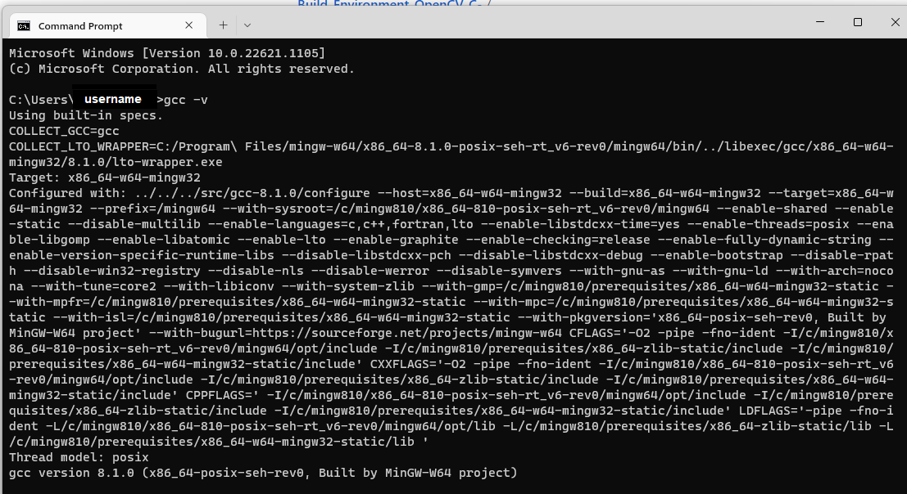
</p>

### **II. Update Environment Variables**

Go to **Start** (you can press Win button). Enter **view advanced system settings**. Click **Environment Variables** and double click **Path** under **System variables** section. Click **New** and mannually add the following two paths (seperately): `$CMAKE$\bin` and `$MINGW$\bin`. Please replace `$CMAKE$` and `$MINGW$` to your own paths. If you followed [Using GCC with MinGW](https://code.visualstudio.com/docs/cpp/config-mingw), you should have already added the MinGW path in the last step. Then you will only need to add CMake to the path. Only if MinGW path is added, you can test if MinGW is properly installed.

<p align="center">
  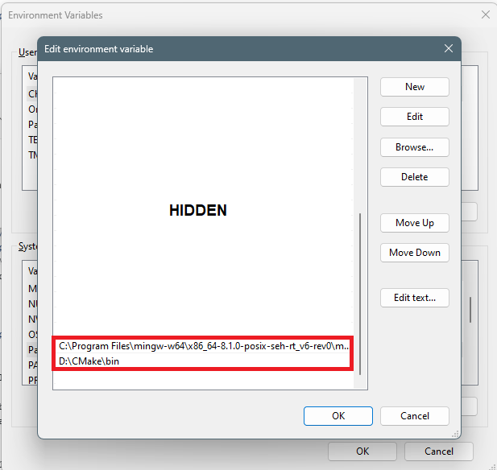
</p>

### **III. Use CMake**

Open **CMake(cmake-gui)** by searching **cmake** in **Start**. Specify **Where is the source code** and **Where to build the binaries**.  For the first domain, it is `$CV$/sources`. For the second domain, it is `$CV$/build/x64/MinGW` (the empty folder created in step **I.2**).

<p align="center">
  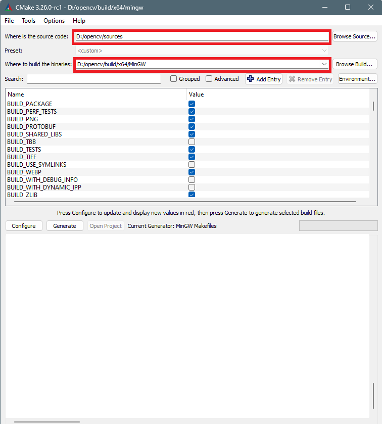
</p>

Click **Configure** and we choose the following options: **MinGW Makefiles** and **Specify native compilers**. Click **Next**.

<p align="center">
  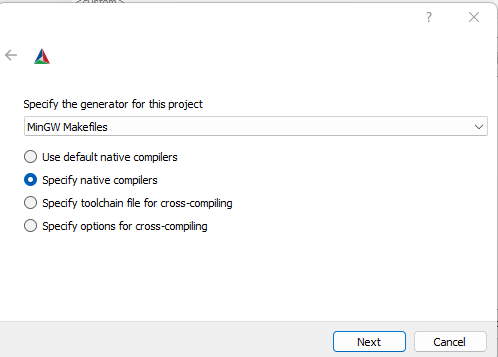
</p>

We need to provide the paths of native C and C++ compilers. They are `$MINGW$/bin/gcc.exe` and `$MINGW$/bin/g++.exe`.

<p align="center">
  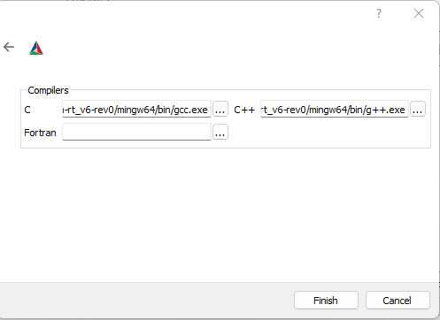
</p>

After the configuration is done, make sure the value of **WITH_OPENGL** is checked, and **WITH_IPP** and **ENABLE_PRECOMPILED_HEADERS** are unchecked. You can quickly find these items by typing their names in the **Search** domain. Then click **Generate**.

When the generation is done, you will see "Generating done" in the message. Go to the folder `$CV$/build/x64/MinGW` and right click to open a **Terminal** at current path. You can also realize this by opening a **Command Prompt** and navigating to `$CV$/build/x64/MinGW` by
```
cd $CV$/build/x64/MinGW
```

Double check that you are at `$CV$/build/x64/MinGW`. In the **Terminal** (or **Command Prompt**), type the command 
```
mingw32-make.exe
```
This will take a while. Please be patient.

<p align="center">
  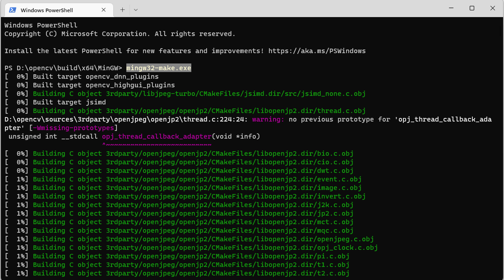
</p>

When this make process is done, you should see "[100%]" with no error message. If there is an error, try to search online and usually you are not the first one who met the issue. You should also go through all above steps and make sure all of them are very carefully followed. A typo will ruin the whole process. Please be careful.

<p align="center">
  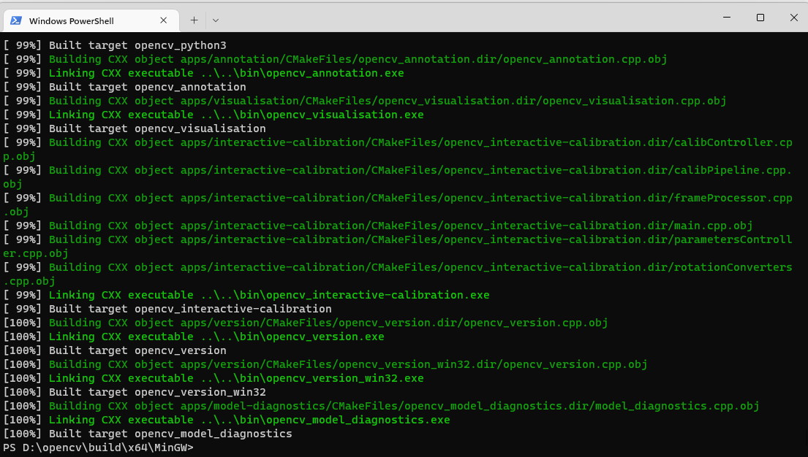
</p>

In the same **Terminal**, type the command 
```
mingw32-make.exe install
``` 
When it is done, CMake part is finished! Congratulations!

<p align="center">
  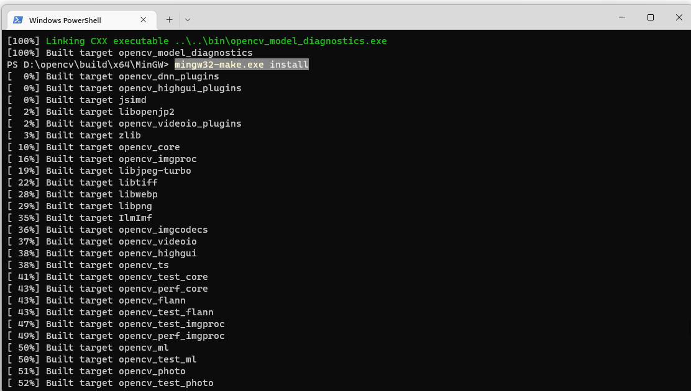
</p>

### **IV. Update Environment Variables (AGAIN)**

Add `$CV$/build/x64/MinGW/bin` to **Path** following similar steps in **II**. Then you should be able to see all three new paths as shown below.

<p align="center">
  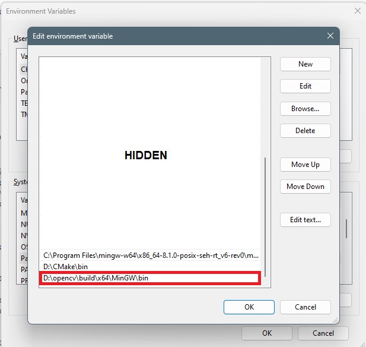
</p>

### **V. The Final Part**

Create a working folder at a desired location. Mine is called "OpenCVTest" at `C:\Users\Yiming Bian\Desktop\OpenCVTest` (desktop). Download the folder "[.vscode](./.vscode)" in this repo and move it to the working directory, in my case it is `C:\Users\Yiming Bian\Desktop\OpenCVTest`. This folder contains three json files: **c_cpp_properties.json**, **launch.json**, and **tasks.json**. You need to modify them as will be mentioned.

Open VS code and open your working directory by **File** -> **Open Folder...**. 

Modify **c_cpp_properties.json** by replacing with your own `$CV$/build/include` and `$MINGW$/bin/gcc.exe` paths, as shown below.

<p align="center">
  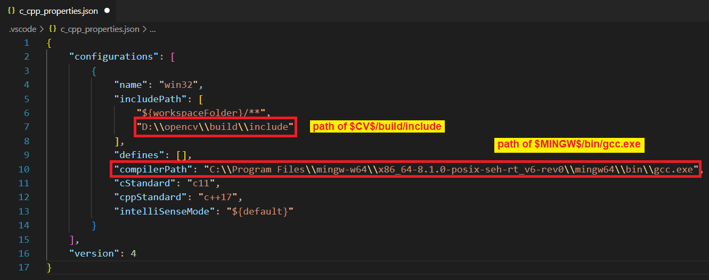
</p>

Modify **launch.json** by replacing with your `$MINGW$/bin/gdb.exe` path.

<p align="center">
  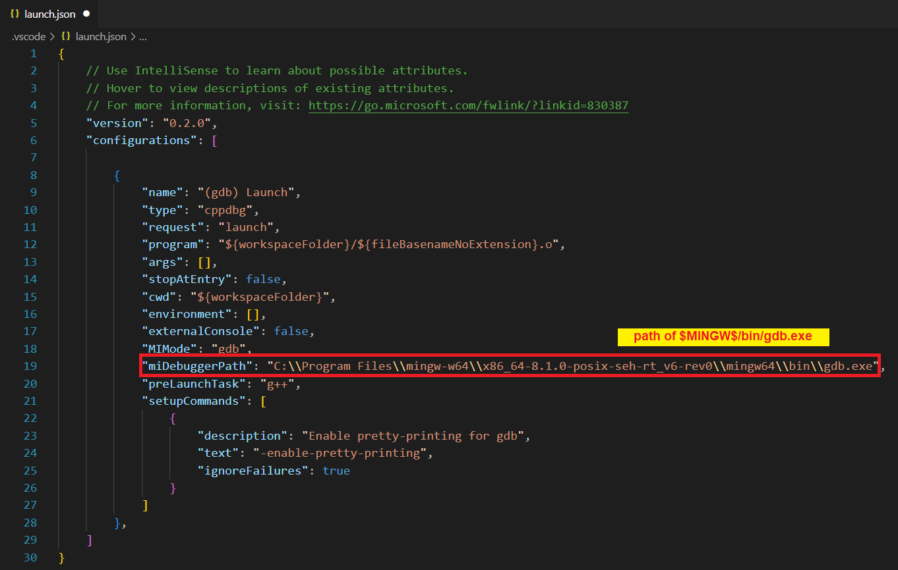
</p>

For **tasks.json**, you may need to make a lot of changes if our OpenCV versions are different. First, you need to update your paths of `$CV$/build/include` and `$CV$/build/x64/MinGW/lib`. Go to `$CV$/build/x64/MinGW/lib` and you will see a bunch of files ending with **.dll.a**. Update this json file with **.dll.a** file names (**ONLY**).  

<p align="center">
  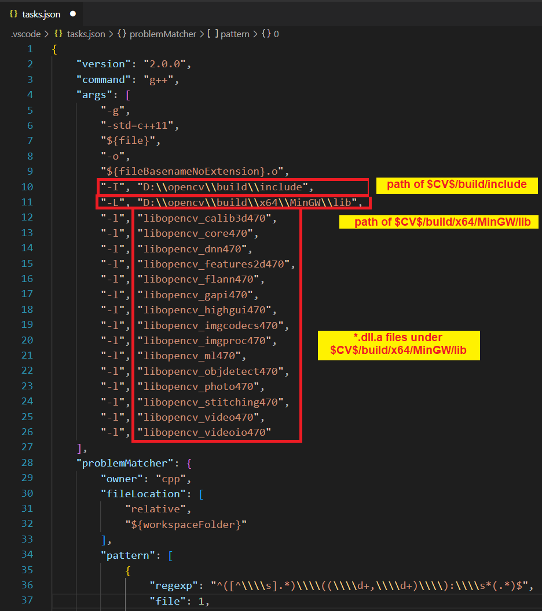
</p>

You are ready to go!

### **Test**

A test image ([Tumbo.jpg](./Tumbo.jpg)) and a test code ([main.cpp](./main.cpp)) are provided in this repo. If you are a beginner, feel free to download these files and move them to the working directory to test if the environment is properly configured. Put them at the same level of **.vscode**, not inside. In VS code, press **F5** or **Run** -> **Start Debugging**, eqivalently, to run the code. If you see an image of Tumbo (my dog) pops up, congratulations! 


## Mac

**Reference**

1. [How to develop an OpenCV C++ algorithm in Xcode](https://anuragajwani.medium.com/how-to-develop-an-opencv-c-algorithm-in-xcode-d676b9aad1b7)

2. [How to Download Xcode and Install it on Your Mac – and Update it for iOS Development](https://www.freecodecamp.org/news/how-to-download-and-install-xcode/)

3. [COMPLETE Xcode Install Tutorial for Beginners | How to Install Xcode](https://www.youtube.com/watch?v=lG9FNv8Txn8)

4. [OpenCV 3.0.0 with Xcode](https://www.youtube.com/watch?v=XJeP1juuHHY)

5. [How to create a txt file in Xcode and use it for input file](https://www.youtube.com/watch?v=7yj15bvfleI)

### **System Configurations**

**OS**: MacOS Ventura 13.2

**Chip**: Apple M1

**IDE**: XCode 14.2 (14C18)

**Compiler**: Apple clang version 14.0.0 (clang-1400.0.29.202)

### **I. Preparation**
We need to make sure the following parts are installed: 1. Xcode 2. OpenCV

**I.1 Install Xcode**

Xcode can be downloaded at [https://apps.apple.com/us/app/xcode/id497799835?mt=12](https://apps.apple.com/us/app/xcode/id497799835?mt=12). Or you can go to **App Store** and download it from there. If you still find it difficult, Google and YouTube will be your friend. Tutorials such as [How to Download Xcode and Install it on Your Mac – and Update it for iOS Development](https://www.freecodecamp.org/news/how-to-download-and-install-xcode/) and [COMPLETE Xcode Install Tutorial for Beginners | How to Install Xcode](https://www.youtube.com/watch?v=lG9FNv8Txn8) are easily accessible.  

**I.2 Install OpenCV**

We download OpenCV using a package manager called [HomeBrew](https://brew.sh). You can go to [https://brew.sh](https://brew.sh) and copy the command given under "Install HomeBrew". Open **Terminal**, paste the command and hit enter. 

With HomeBrew installed, in the same **Terminal** window, type the command 
```
brew install opencv
```

At the time of writing, the latest OpenCV version is `4.7.0`. As pointed out by user "Ortomala Lokni" in this [question](https://apple.stackexchange.com/questions/64455/is-the-cellar-folder-only-used-for-homebrew), **Cellar** folder will be placed under `/usr/local/` for Intel Mac while it is placed under `/opt/homebrew/` for Apple silicon Mac. **Cellar** is the mother folder of **opencv** and the path of **opencv** is critical. Since I am using an M1 Mac, I will be using `/opt/homebrew/Cellar` as the mother folder of **opencv**. For Intel Mac users, just substitute the corresponding path with `/usr/local/`.

If you go to `/opt/homebrew/Cellar/opencv/4.7.0_1/` (version could vary), you should see every component of OpenCV there. Navigating can be done by pressing `Shift + Command + g` in **Finder** and specifying the path.

### **II. Use Xcode**

**II.1 Create A Project**

Open **Xcode** to create a new project, select **Command Line Tool** under **macOS** platform tab.

<p align="center">
  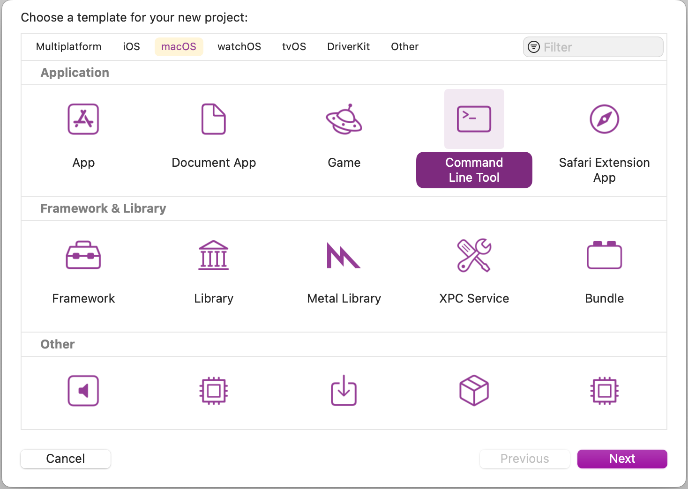
</p>

Specify the project name (in my case, it is "OpenCVTest") and language to C++.

<p align="center">
  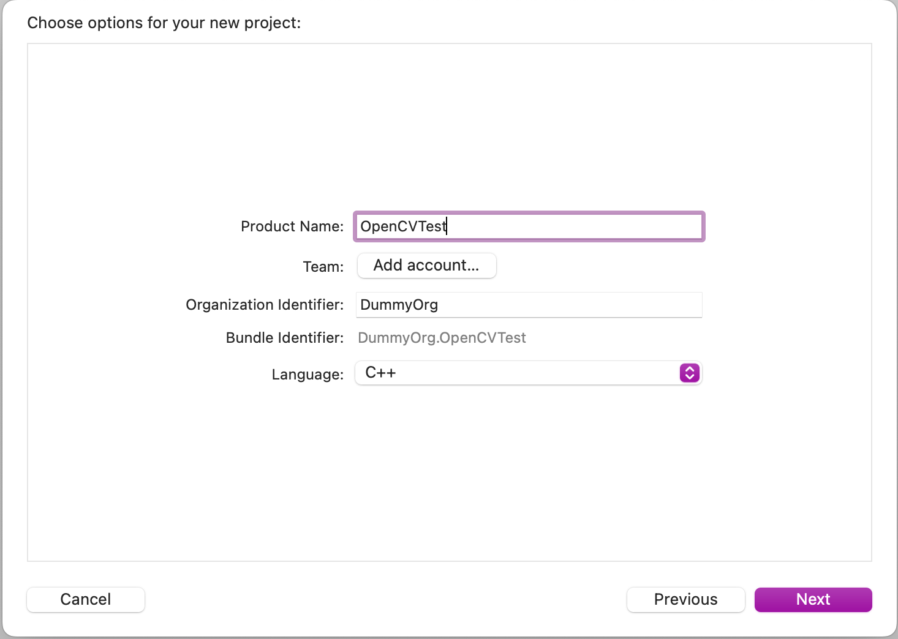
</p>

**II.2 Link OpenCV**

First we need to make sure `pkg-config` is installed. Typing the following command in **Terminal**.
```
brew install pkg-config
```

It will either start the installation process or show you an message saying that it is installed already.

Then we set the configuration path by typing the command in the same **Terminal** window.
```
export PKG_CONFIG_PATH=/usr/local/lib/pkgconfig
```

Now `pkg-config` is ready to tell us about the configuration settings of OpenCV so that we can link it to the OpenCVTest project.

To list OpenCV libraries, we type the command below in **Terminal**.
```
pkg-config --libs-only-l opencv4
```

We mark the figure below as `FIG_A`.

<p align="center">
  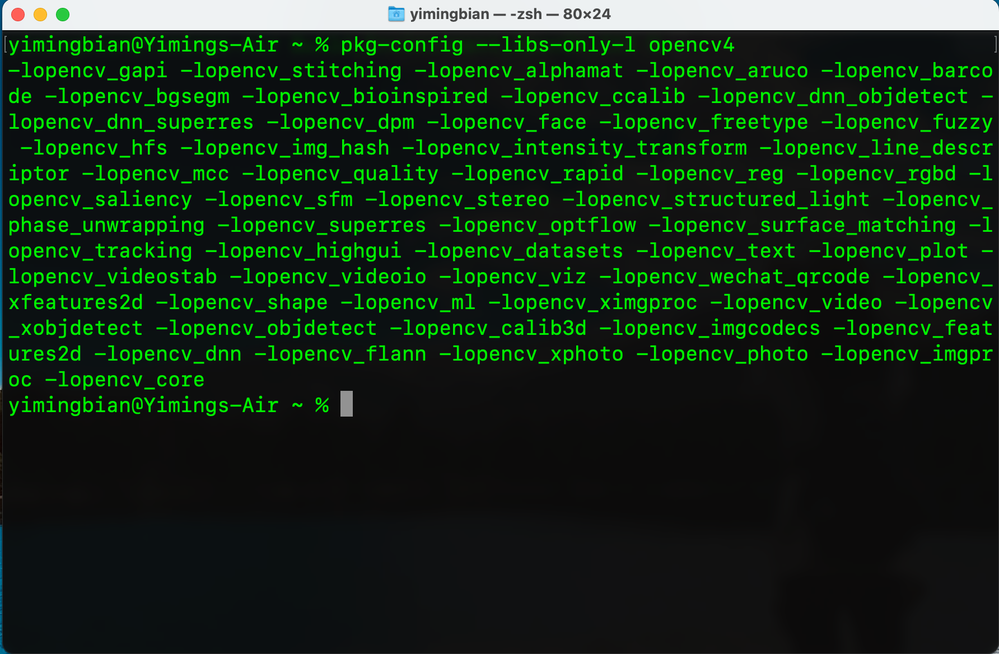
</p>

We can query OpenCV modules by command
```
pkg-config --libs-only-L opencv4
```
and we query the local of OpenCV by command
```
pkg-config --cflags opencv4
```

You should observe a similar output as shown below. This figure is marked as `FIG_B`.

<p align="center">
  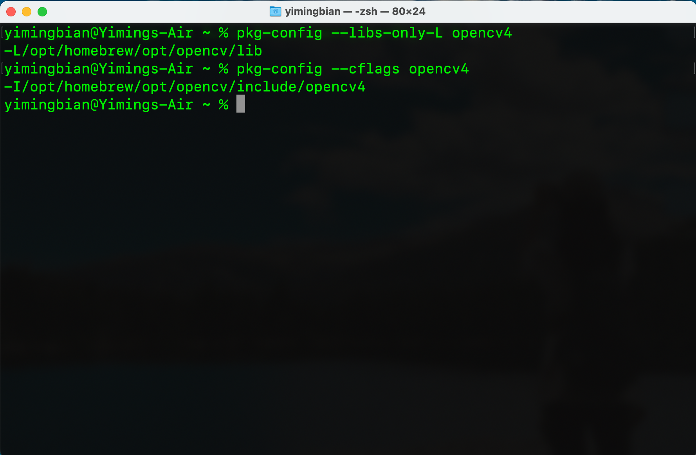
</p>


### **Test**
